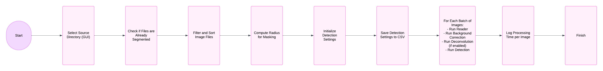

PIScO Image Segmentation Schematic
====================================

This document provides a detailed breakdown of each step involved in the image processing application. The application is designed to process images with a series of operations including segmentation and detection.

1. Select Source Directory
---------------------------

A Graphical User Interface (GUI) is used to select the directory containing the images to be processed.

2. Check if Files are Already Segmented
---------------------------------------

The software checks if the images have already been processed by comparing file names in the output directory.

3. Filter and Sort Image Files
------------------------------

- **Filter**: Filters the image files to include only those with specific extensions (.png, .jpg) and valid image headers.
- **Sort**: Sorts the filtered files based on the timestamp extracted from the filenames.

4. Compute Radius for Masking
-----------------------------
.. autofunction:: segmenter.compute_radius

Computes a radius value used for masking based on a few sample images from the input directory.

5. Initialize Detection Settings
--------------------------------

Initializes the detection settings using a data class `DetectionSettings` which includes various parameters like paths, area thresholds, and processing flags.

6. Save Detection Settings to CSV
---------------------------------

Saves the initialized settings to a CSV file for record-keeping and reproducibility.

7. For Each Batch of Images
---------------------------

    a. **Run Reader**: Reads batches of images concurrently.
    b. **Run Background Correction**: Applies background correction to enhance image quality.
    c. **Run Deconvolution (if enabled)**: Optionally applies deconvolution to further clarify image details.
    d. **Run Detection**: Performs the actual detection and segmentation of features in the images.

8. Log Processing Time per Image
--------------------------------

Logs the time taken to process each image for performance analysis.

9. Finish
---------

Concludes the segmentation process.

Note
----

This document outlines the high-level workflow and is intended for use by developers and users familiar with the software. For more detailed technical documentation, refer to the software's codebase and comments.